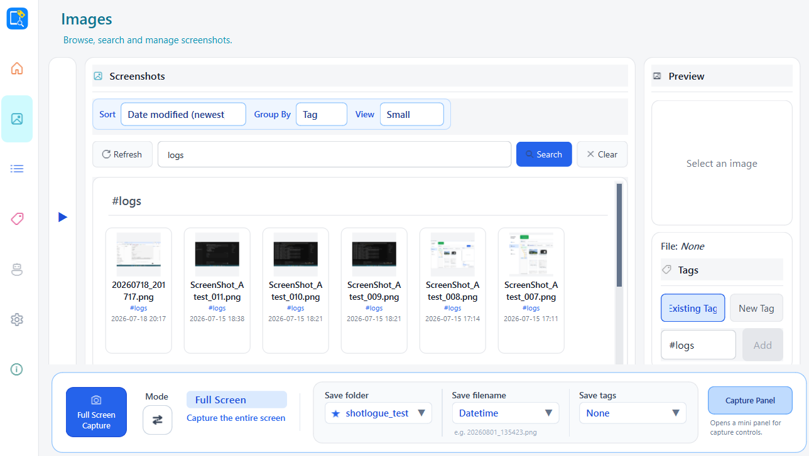

# Capixe

Capture less. Find more.

Capixe is a local-first Windows app for capturing screenshots and finding them again. Choose an Images folder, analyze its PNG files on your PC, then search by filename or text visible inside each image.

## Screenshot



## Preview status

This is a **Prototype Preview** (`v0.1.0-preview`). Bugs, incomplete features, and breaking changes are expected.

## Features

- Region and full-screen capture
- Configurable save location, filename rule, and keyboard shortcuts
- Browse a selected Images folder
- Local image analysis using bundled OCR models
- Search by filename and text found inside images
- Grid/list viewing, grouping, preview, and zoom
- First-run guide for the Folder -> Analyze -> Search flow

Image analysis runs locally. Capixe does not upload screenshots to a Capixe cloud service.

## Download and installation

Download `Capixe-v0.1.0-preview-win64.zip` from [GitHub Releases](https://github.com/p1rworks24-ops/Capixe/releases), extract it completely, then run `Capixe.exe` inside the extracted `Capixe` folder.

Keep `Capixe.exe` together with the `_internal` folder. Python is not required. This preview has no installer or automatic updater.

### Windows security warning

This preview is not code-signed, so Windows SmartScreen, Microsoft Defender, or an organization policy may show a warning. Continue only if you trust this repository and the downloaded Release.

## Data storage

- Settings: `%APPDATA%\Capixe`
- Local image-analysis index: `%LOCALAPPDATA%\Capixe`
- Default screenshot root for new users: `%USERPROFILE%\Pictures\Capixe`

Changing or moving the application folder does not move screenshots or settings.

## Known limitations

- Windows 10/11 (64-bit) only
- Prototype Preview; features may change
- Unsigned portable build; no installer or auto-update
- Image analysis currently supports PNG files
- Capture shortcuts work only while Capixe is running

## Feedback

- [Bug report](https://github.com/p1rworks24-ops/Capixe/issues/new?template=bug_report.yml)
- [Feature request](https://github.com/p1rworks24-ops/Capixe/issues/new?template=feature_request.yml)

Do not post passwords, API keys, personal emails, or private file paths in Issues.

## Development

```text
python -m venv .venv
.venv\Scripts\activate
python -m pip install -r requirements.txt
python main.py
```

For source runs, set `CAPIXE_OCR_PYTHON` to a Python environment containing the OCR dependencies and `CAPIXE_OCR_MODEL_DIR` to the three local PP-OCR model files. The Release build bundles both and does not need these variables.

Packaging:

```text
python -m pip install -r requirements-dev.txt
python -m PyInstaller Capixe.spec --clean --noconfirm
powershell -ExecutionPolicy Bypass -File packaging\pack_release_zip.ps1
```

The packaging step expects local OCR model files under `tools\ocr_poc\models`; that directory is intentionally excluded from Git.

## License

Capixe is proprietary software. Copyright © 2026 Capixe. All rights reserved.

See [LICENSE](LICENSE) for details.
