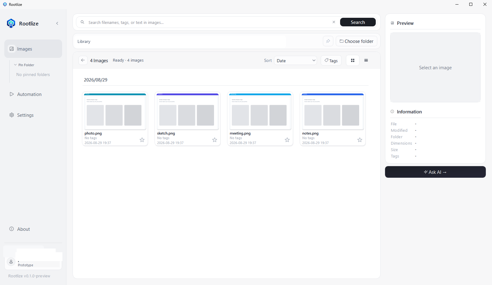

# Rootlize

Your Local Workspace.

Find, organize, and work with the images on your PC — without moving them to the cloud.

Sign in, point Rootlize at an existing local folder, then find, organize, and work with the images already on your PC. Basic Search, OCR, and bundled Meaning Search run locally. Ask AI needs the internet after you agree.

## Screenshot



## Preview status

This is a **Prototype Preview** (`v0.1.0-preview`). Bugs, incomplete features, and breaking changes are expected. The Features and limitations below describe the published ZIP, not necessarily the current source tree.

## Features

- Sign in required to start the Prototype
- Use an existing local image folder — files stay on this PC
- Basic Search by filename, tags, and text found inside images
- Meaning Search by what an image shows (bundled model, no extra setup)
- Ask AI to find and organize in your own words (needs internet after you agree)
- Organize in place: rename, tags, favorites, move
- Save a repeated flow as Automation
- Region and full-screen capture with configurable save settings
- Grid/list viewing, grouping, preview, and zoom

Rootlize does not move your image library to a Rootlize cloud. Basic Search, OCR, and bundled Meaning Search run locally. Account features and Ask AI need sign-in and the internet.

## Download and installation

Download `Rootlize-v0.1.0-preview-win64.zip` from [GitHub Releases](https://github.com/p1rworks24-ops/Rootlize/releases), extract it completely, then run `Rootlize.exe` inside the extracted `Rootlize` folder.

Keep `Rootlize.exe` together with the `_internal` folder. Python is not required. This preview has no installer or automatic updater.

### Windows security warning

This preview is not code-signed, so Windows SmartScreen, Microsoft Defender, or an organization policy may show a warning. Continue only if you trust this repository and the downloaded Release.

## Data storage

Existing user data stays in the original folders (the public name changed; the on-disk location did not):

- Settings: `%APPDATA%\Capixe`
- Local search index: `%LOCALAPPDATA%\Capixe`
- Default screenshot root for new users: `%USERPROFILE%\Pictures\Capixe`

Changing or moving the application folder does not move screenshots or settings.

## Known limitations

- Windows 10/11 (64-bit) only
- Prototype Preview; features may change
- Unsigned portable build; no installer or auto-update
- Local search currently indexes PNG files most completely
- Capture shortcuts work only while Rootlize is running

## Feedback

- [Bug report](https://github.com/p1rworks24-ops/Rootlize/issues/new?template=bug_report.yml)
- [Feature request](https://github.com/p1rworks24-ops/Rootlize/issues/new?template=feature_request.yml)

Do not post passwords, API keys, personal emails, or private file paths in Issues.

## Development

This section is for source-tree contributors. The product copy above describes the published Prototype Preview and is **not** the implementation spec. Local technical Source of Truth is `.ai/START.md` (gitignored).

Use **Python 3.12**. Packaged builds refuse any other version (`Capixe.spec`). Prefer `.build-venv` for the app and `tools\ocr_poc\.venv` for OCR, matching `Run Capixe.bat` when that launcher exists locally.

### App + OCR environment

```text
python -m venv .build-venv
.build-venv\Scripts\python.exe -m pip install -r requirements.txt
.build-venv\Scripts\python.exe -m pip install -r requirements-dev.txt

python -m venv tools\ocr_poc\.venv
tools\ocr_poc\.venv\Scripts\python.exe -m pip install -r tools\ocr_poc\requirements-ocr-poc.txt
tools\ocr_poc\.venv\Scripts\python.exe tools\ocr_poc\prepare_models.py
```

`prepare_models.py` writes the three PP-OCRv6 ONNX files into `tools\ocr_poc\models` (gitignored). Required files:

* `PP-OCRv6_det_small.onnx`
* `PP-OCRv6_rec_small.onnx`
* `ch_ppocr_mobile_v2.0_cls_mobile.onnx`

### Run from source

```powershell
$env:CAPIXE_OCR_PYTHON = "tools\ocr_poc\.venv\Scripts\python.exe"
$env:CAPIXE_OCR_MODEL_DIR = "tools\ocr_poc\models"
.build-venv\Scripts\python.exe main.py
```

Meaning search’s Vision Judge also needs `OPENAI_API_KEY` in the same environment. The key is never stored or logged by Rootlize. Local OCR and OpenCLIP embeddings do not need the network.

Optional real OCR worker test: `app/ocr/WORKER_TESTING.md`.

### Tests

```text
.build-venv\Scripts\python.exe -m pytest -q
```

### Build

Public Prototype confirmation uses one official EXE:

`dist\Rootlize\Rootlize.exe`

```text
.build-venv\Scripts\python.exe tools\build_official_prototype.py
```

This command refuses to succeed if Authentication is not configured. It reads publishable settings from `CAPIXE_SUPABASE_URL` / `CAPIXE_SUPABASE_PUBLISHABLE_KEY`, `resources\auth-source.local.json` (gitignored), or the linked Supabase CLI project. Provider secrets are never baked in.

Do not confirm a public Prototype from `artifacts\...`, PyInstaller `build\`, or other EXEs. `Run Capixe.bat` is the local source launcher (`.build-venv` + `main.py`) for in-progress checks only. Final human E2E uses `dist\Rootlize\Rootlize.exe` after `tools/build_official_prototype.py`. Latest is `dist\Rootlize\_internal\build-info.json` (`build_id` / `source_revision` / `official=true`), not file mtime. `Rootlize.exe --version` prints the same identity. Raw `PyInstaller Capixe.spec` will not overwrite `dist\Rootlize` when Auth is missing. Auth-less output requires `CAPIXE_ALLOW_UNCONFIGURED_DIST=1` and writes to `dist\Rootlize-unconfigured`.

Optional ZIP:

```text
powershell -ExecutionPolicy Bypass -File packaging\pack_release_zip.ps1
```

`Capixe.spec` requires Python 3.12 and the three OCR model files under `tools\ocr_poc\models`. Distribute the whole `dist\Rootlize\` folder (`Rootlize.exe` + `_internal`).

Packaged / real-API Meaning verification: `docs/VISION_RELEVANCE_REAL_API_RUNBOOK.md`.

### Website / landing page

See `website/README.md`. Local preview:

```text
python -m http.server 8080 --directory website
```

## License

Rootlize is proprietary software. Copyright © 2026 Rootlize. All rights reserved.

See [LICENSE](LICENSE) for details.
