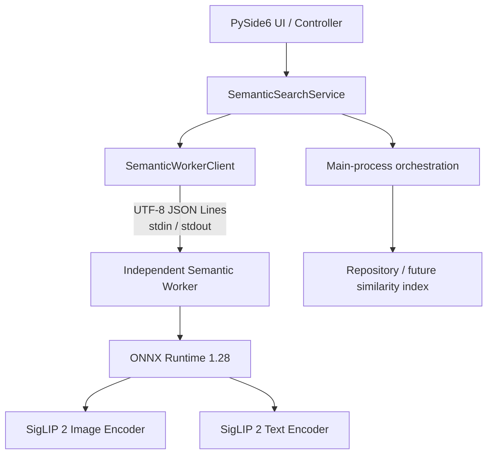
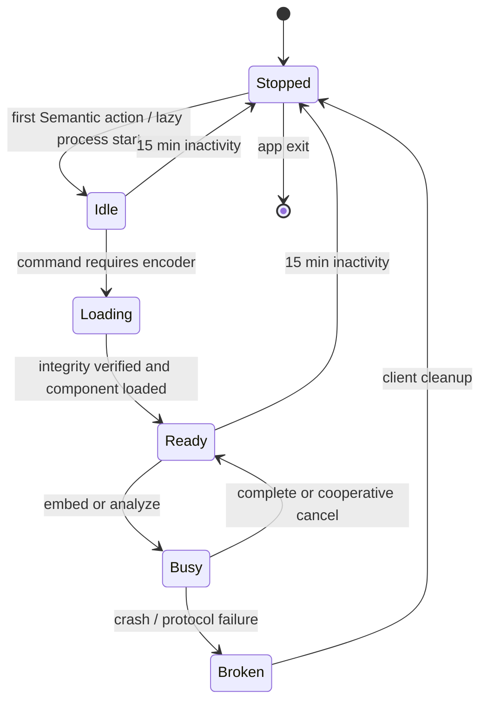

# Semantic Search Worker 設計（履歴）

**このファイルは現行の製品仕様ではない。** 実装正本は `.ai/SPEC.md`。Retrieval は OpenCLIP ViT-B/32（512 次元、raw `{q}`）。SigLIP 2 / 768 次元 / PNG only / 「次は Images へ接続」は廃止済み前提である。

IPC・worker 分離・bundle 検証の骨格をコードと照合するとき以外は読まない。新規チャットの既定参照先にしない。

## Scope and fixed assumptions

この文書は Semantic Search の独立 worker、IPC、model lifecycle、model bundle、および embedding 永続化について、**当時**の設計メモである。downloader、検索 UI、Hybrid Search、現行 Meaning Judge は対象外とする。

当時の固定条件は SigLIP 2 Base/224、ONNX Runtime 1.28 FP32、embedding 768 次元、batch size 1、intra-op 4、inter-op 1、sequential execution、model は optional download だった。Semantic worker は OCR worker と別 process とし、既存 Capixe と OCR は Semantic が未導入・故障中でも動作を続ける、という方針は現行も有効である。

## Responsibilities and architecture



| Layer | Owns | Does not own |
|---|---|---|
| `SemanticSearchService` | lazy start、解析 orchestration、OCR との排他、timeout/retry 判断、正常な item result の Repository への引き渡し | 推論、UI widget、worker 内 DB write |
| `SemanticWorkerClient` | subprocess、request ID、JSON Lines の送受信、event routing、timeout、graceful shutdown/terminate、crash 検出 | model や DB の意味的判断 |
| Semantic worker | bundle 検証、encoder/tokenizer/preprocess load、画像/テキスト embedding、batch の逐次実行、progress、協調 cancel、status | SQLite、folder scan/diff、ranking、OCR、tag/file 操作、user preference |
| Repository（本体） | 完了済み embedding の transaction、model metadata との関連付け | 推論 |

OCR worker から subprocess 起動、UTF-8 JSON Lines、version/request ID、stdout 専用化、stderr tail、shutdown→terminate、例外分類を再利用する。既存 OCR は変更しない。Semantic は event と cancel を扱うため専用 protocol/client とし、将来両者が安定してから小さな transport helper の共通化だけを検討する。

## IPC transport and concurrency

- local child process の stdin/stdout pipe を使う。各行は UTF-8 JSON object 1件、末尾 LF。`shell=False`、stdout は protocol 専用、診断は stderr とする。
- `protocol_version` は初版 `1`。未知 version/type、必須 field 欠落、重複中の `request_id`、message size 超過は `INVALID_REQUEST` とする。
- `request_id` は本体で生成する UUID v4（lowercase hyphenated string）。response/event は元 request と同じ ID を必須とする。`cancel` 自身も別 ID を持ち、`target_request_id` で対象を指す。
- worker は重い primary command（load/embed/analyze）を同時に1件だけ実行する。`ping`、`get_status`、`cancel`、`shutdown` は control command として実行中にも受信できる。
- client は stdout reader thread 1本で message を decode し、`request_id` ごとの待機先と event callback/queue へ振り分ける。worker は stdin reader/main loop と推論 executor 1本を分け、cancel flag を thread-safe に更新する。ONNX session 自体を並列呼び出ししない。
- 1 message の上限は 8 MiB。`analyze_images` は全結果を1 responseへ詰めず、item event を逐次送る。

### Envelope

Command:

```json
{"protocol_version":1,"type":"command","request_id":"550e8400-e29b-41d4-a716-446655440000","command":"embed_text","payload":{"text":"夕焼けの海"}}
```

Success response（各 command につき最終1件）:

```json
{"protocol_version":1,"type":"response","request_id":"550e8400-e29b-41d4-a716-446655440000","status":"ok","result":{}}
```

Event（最終 response より前に0件以上）:

```json
{"protocol_version":1,"type":"event","request_id":"550e8400-e29b-41d4-a716-446655440000","event":"progress","payload":{"processed":124,"succeeded":123,"failed":1,"total":1000,"elapsed_ms":42000}}
```

Error response:

```json
{"protocol_version":1,"type":"response","request_id":"550e8400-e29b-41d4-a716-446655440000","status":"error","error":{"code":"MODEL_NOT_INSTALLED","message":"Semantic model is not installed.","retryable":false,"details":{"component":"bundle"}}}
```

`message` はユーザーへ表示可能な非機密文、`details` は allowlist 済みの短い debug metadata とし、traceback・query・embedding・画像内容・完全 path は含めない。詳細 traceback は worker stderr に出せるが、入力内容は伏せる。

## Commands

| Command | Payload | Result / behavior |
|---|---|---|
| `ping` | `{}` | `worker_state`、`protocol_version`。model 未導入でも成功 |
| `load_model` | `components: ["image_encoder" | "text_encoder"]` | bundle を検証し必要 component だけ idempotent load。model metadata と load time |
| `embed_image` | `image_id`, `path`, file snapshot | image encoder を必要時 loadし、1件の embedding result |
| `embed_text` | `text` | 入力を翻訳・言語判定せず tokenizer へ渡し、1件の embedding result |
| `analyze_images` | `items[]`（`image_id`, `path`, snapshot） | batch size 1で順次処理。`item_result` と `progress` event、最後に summary response |
| `cancel` | `target_request_id` | flag を設定し `accepted`, `already_finished`, `not_found` のいずれかを返す |
| `get_status` | `{}` | worker/model component/current request の状態。path/query は返さない |
| `shutdown` | `{graceful:true}` | 新規 primary command を拒否し、実行中なら cancel、現在画像終了後に model 解放・終了 |

`unload_model` は MVP command にしない。idle 時は process ごと終了する。`load_model` は明示利用と embed 系の暗黙 load の両方を許し、実装は同じ処理を呼ぶ。

`image_id` は既存 DB の正の INTEGER `images.image_id` を protocol上では10進文字列として扱い、workerにとっては算術やpath解決に使わない不透明値とする。ServiceはDBとの境界でcanonical representationを検証・変換する。path は読取り用で identifier として保存・表示しない。現行 Capixe の対象に合わせ、MVP の対応形式は folder 直下の通常ファイルである `.png` のみとする。Service と worker の双方で extension を検証し、worker は存在、regular file（symlink 非追跡）、snapshot、PNG header/dimensions、安全な pixel 上限も再検証する。directory scan、glob、URL、URI は受け付けない。

## Embedding result and serialization

```json
{
  "image_id":"opaque-id",
  "embedding":{"encoding":"base64","dtype":"float32","byte_order":"little","dimension":768,"data":"..."},
  "model":{"model_id":"siglip2-base-patch16-224","bundle_version":"1","embedding_dimension":768},
  "duration_ms":123.4
}
```

Worker→本体は L2 normalized FP32 768値を、little-endian contiguous bytes の base64 として送る。これにより model output の精度を失わず schema 検証できる。Repository も同じ 3,072 bytes の binary representation を BLOB として保存する。

1 embedding は raw 3,072 bytes、base64 約4,096 bytesである。10,000件では payload 本体が約39 MiB（envelope 除く）。JSON number array は値の表記次第で概ね80–150 MiBになり decode/allocation も増える。base64 は十分保守的で、1件ずつ streaming すれば message 上限と peak memoryを抑えられる。binary protocol/shared memory は計測で IPC が主要 bottleneck と判明した場合だけ、`embedding.encoding` を追加して拡張する。

`analyze_images` は成功した画像ごとに `item_result` event を送り、本体は受信単位で保存可能とする。失敗画像は embedding を持たない `item_error` event とする。最終 response は `completed|cancelled`、processed/succeeded/failed/remaining の summary のみ。file snapshot が変化した結果は成功扱いせず保存しない。

## Persistence format

保存形式は version 付きの固定長 binary BLOB とする。

| Property | Value |
|---|---|
| precision / dtype | IEEE 754 float32 |
| byte order | little-endian |
| dimension | 768 |
| byte length | 3,072 bytes |
| layout | contiguous、要素順は model output と同じ |
| normalization | 保存前に L2 normalized であることを検証 |
| format version | `embedding_format_version = 1` |

JSON number array は容量と parse 負荷が大きく、1次元を1 rowに分ける形式は row/index overhead と整合性管理を増やすため採用しない。FP16 は容量を半減できるが model output との精度差と将来の ranking 差を持ち込むため、初版では採用しない。10,000件で raw vector は約29.3 MiB、50,000件で約146.5 MiB（いずれも SQLite の row/index overhead を除く）である。

`embedding_format_version` は precision、endianness、dimension、normalization、layout の意味をまとめる。model の変更はこの version を上げず model identity で区別し、binary contract が変わる場合だけ version を上げる。

保存前に Service が base64 を decode し、Repository 境界で次を再検証する。

- `bytes` または read-only bytes-like value で、長さが `dimension * 4 = 3072`
- metadata が dtype `float32`、byte order `little`、dimension `768`、format version `1`
- 全768値が finite で NaN / Inf を含まない
- L2 norm が `1.0 ± 1e-3`。0 vector は拒否する
- result の model identity が、処理開始時に固定した active manifest と一致する
- result の source snapshot が、保存直前の `images` row と実ファイル snapshot に一致する

不正 result はその画像だけ `INVALID_EMBEDDING` として失敗記録し、BLOB、値、完全 path は log に出さない。

## SQLite schema

Semantic は既存の再生成可能な `ocr-index.sqlite3`、`schema_meta`、WAL、`PRAGMA foreign_keys=ON`、逐次 migration をそのまま使う。独立DBや独立 migration frameworkは作らない。

```sql
CREATE TABLE semantic_embeddings (
  image_id INTEGER PRIMARY KEY
    REFERENCES images(image_id) ON DELETE CASCADE,
  embedding BLOB NOT NULL CHECK(length(embedding) = 3072),
  dimension INTEGER NOT NULL CHECK(dimension = 768),
  embedding_format_version INTEGER NOT NULL CHECK(embedding_format_version > 0),
  model_id TEXT NOT NULL,
  bundle_version TEXT NOT NULL,
  model_revision TEXT NOT NULL,
  pipeline_version INTEGER NOT NULL CHECK(pipeline_version > 0),
  source_size_bytes INTEGER NOT NULL CHECK(source_size_bytes >= 0),
  source_mtime_ns INTEGER NOT NULL CHECK(source_mtime_ns >= 0),
  source_quick_fingerprint TEXT,
  created_at TEXT NOT NULL,
  updated_at TEXT NOT NULL
);

CREATE INDEX semantic_embeddings_model_idx
  ON semantic_embeddings(
    model_id, bundle_version, model_revision,
    pipeline_version, embedding_format_version
  );

CREATE TABLE semantic_analysis_failures (
  image_id INTEGER PRIMARY KEY
    REFERENCES images(image_id) ON DELETE CASCADE,
  error_code TEXT NOT NULL,
  retryable INTEGER NOT NULL CHECK(retryable IN (0, 1)),
  attempt_count INTEGER NOT NULL CHECK(attempt_count > 0),
  last_attempt_at TEXT NOT NULL
);
```

`image_id` は既存 `images.image_id`（INTEGER）を唯一の identity とする。path は外部キーや Semantic の identity にしない。既存の move / rename 検出が同じ `image_id` を維持する限り embedding を再利用でき、画像削除時は foreign key cascade で embedding と failure が削除される。

`semantic_embeddings` は成功済みの current row だけを持つ。別の status column は設けず、状態を次のように導出することで二重状態を避ける。

- rowなし + failureなし: `MISSING_EMBEDDING`
- rowなし + failureあり: `FAILED`（次回 Analyze で retry可能）
- rowあり + source/model/format一致: `UNCHANGED`
- rowあり + source不一致: `MODIFIED`
- rowあり + model、bundle、revision、pipeline、format、dimension のいずれか不一致: `STALE_MODEL`
- rowはあるが BLOB null相当、長さ不一致、metadata不整合、decode不能、NaN / Inf: `CORRUPT`
- inventoryから消えた image: `DELETED`

`pending` と `running` は batch queue / worker request の一時状態であり、初版では永続化しない。crash 後は row の有無から安全に再開できる。failure は error code、retryable、回数、最終試行時刻だけを保持し、query、embedding、画像内容、完全 path、個人情報を含む message は保存しない。成功 upsert と同じ transaction で該当 failure を削除する。

`image_id` は既に primary key のため追加 index は不要で、BLOB 自体へ B-tree index は作らない。model composite index は active model と異なる row の列挙に使う。folder / set 絞り込みは既存 `images` と既存関連 table を join し、Semantic 専用の重複列を持たない。

## Diff and stale decision

Semantic diff は既存 inventory / OCR diff が確定した `image_id`、file state、size、mtime、quick fingerprint を再利用する。Semantic 専用 content hash は追加しない。mtimeだけが変わり既存 diff が quick fingerprint 一致として content unchanged と認定した場合は、Repository の source snapshot metadataだけを更新して embedding を再利用できる。

判定優先順位は `DELETED → MISSING_EMBEDDING/FAILED → CORRUPT → MODIFIED → STALE_MODEL → UNCHANGED` とする。source と model の両方が古い場合は `MODIFIED` として再解析すれば一度で両方を更新できる。`CORRUPT` は当該 row を読取り結果として返さず再解析対象にするが、diff 中に DB 全体を破棄しない。

active identity は `model_id + bundle_version + model_revision + pipeline_version + embedding_format_version + dimension`。manifest の `normalized=true` と dtype `float32` は format version 1 の前提として load / save の両方で検証する。bundle更新は画像が未変更でも stale になる。

## Commit boundary and failure isolation

transaction boundary は既定で画像1件とする。1件の `item_result` ごとに「保存直前 snapshot 確認 → validated upsert → failure削除」を1つの短い transaction で commit する。SQLite commit が実測上 bottleneck になった場合だけ、最大16件または250 msの小 chunkへ変更できるが、cancel時も受信・検証済み chunk は commitしてから停止する。

この境界により、1,000件中500件完了後の cancel、worker crash、IPC切断でも500件は保持される。未受信・検証失敗・保存失敗 itemだけが次回対象となる。全batchを1 transactionにして rollbackしない。

- 画像固有の decode / inference / validation / constraint failure: 当該画像を failure として記録し、次へ進む
- snapshot mismatch / file missing: stale resultを保存せず、inventory refresh後の再試行対象にする
- `SQLITE_BUSY`: busy timeout後に当該itemを限定回数 retryし、失敗ならそのitemを未保存のまま次へ進む
- corruption、disk full、I/O error、schema mismatch、connection failure: DB全体に関わるためbatchを停止する

failure row の書込み自体が失敗しても既存の正常 embedding を上書き・削除しない。再解析失敗時も旧 embedding は保持するが、source/model不一致のため検索候補には使わない。

## SemanticRepository contract

Repository は永続化と identity lookup に限定し、cosine similarity、ranking、query embedding cache、worker lifecycle、folder scanを所有しない。

```text
get_embedding(image_id) -> SemanticEmbeddingRecord | None
get_embedding_metadata(image_id) -> SemanticEmbeddingMetadata | None
list_embeddings(image_ids=None, folder_path=None) -> iterable[SemanticEmbeddingRecord]
classify_embeddings(image_ids, active_identity) -> mapping[image_id, SemanticDiffState]
upsert_embedding(image_id, embedding_bytes, metadata, source_snapshot) -> SemanticEmbeddingRecord
record_failure(image_id, error_code, retryable, attempted_at) -> SemanticFailureRecord
clear_failure(image_id) -> None
delete_embedding(image_id) -> None
delete_embeddings(image_ids) -> int
delete_orphans() -> int
```

契約上の規則:

- `get_embedding` / `list_embeddings` は BLOBを検証し、corrupt rowを正常 recordとして返さない。`classify_embeddings` は `CORRUPT` を返せる
- `upsert_embedding` は既存 `image_id` と present file state、active model identity、source snapshotを同一 transaction内で検証する。insert/updateの重複呼出しは idempotent
- updateでも `created_at` は維持し、`updated_at` だけを更新する
- `delete_embedding` は明示的な再解析リセット用。通常の画像削除は `images` の cascadeに任せる
- `delete_orphans` はforeign key無効期間や旧DB由来の防御的maintenanceであり、通常経路では0件を期待する
- folder / set lookupは既存identity tableとのjoin。結果は常に既存 `ImageRecord` へ戻せる `image_id` を使う

Similarity prototype は Repository から activeかつ正常な embedding 群を読み、Service 層で FP32 matrix / cosine similarityを計算する。10,000件なら約29.3 MiBで全件読込みが現実的である。初版ではcacheを必須にせず、計測後に process内 matrix cache、lazy cache、folder cacheを検討する。query embedding は一時的でありDBへ保存しない。

将来 Faiss、SQLite vector extension、HNSWを導入する場合も、`semantic_embeddings` を正本または再構築元として扱う。固定長little-endian FP32、明示的identity、format versionにより index adapterを追加でき、初版schemaへ将来index固有列を先取りしない。

## Delete, rename, folder removal, and data lifecycle

- image delete: 既存 `images` row削除を正本とし、embedding / failure は `ON DELETE CASCADE`
- temporary missing: 既存方針どおり `images.file_state='missing'` を保持する間は embedding も保持するが検索対象外。復帰してcontent unchangedなら再利用する
- move / rename: 既存 diff が同一 `image_id` を維持すれば embeddingを再利用し、pathだけでは staleにしない
- folder管理解除: その操作が既存 image inventoryを削除する設計ならcascade削除する。inventoryを保持する設計ならembeddingも保持する。Semanticだけ永久保持する別ルールは作らない
- Capixe user data削除 / index再構築 / backup: 既存 `ocr-index.sqlite3` と同じdata lifecycleに従う

embedding は画像由来のローカルデータである。外部送信、telemetry、通常logへの出力を禁止し、backupや削除でもDB本体から切り離さない。

## Migration

既存 `OCRDatabase._migrate()` の逐次 schema versionを1つ進め、上記2 tableとindexを `BEGIN IMMEDIATE` 内で `CREATE` してから `schema_meta.schema_version` を更新する。新規DBの `SCHEMA_SQL` にも同じ定義を追加する。migrationは既存 `images`、OCR、tags、folders、FTS rowsを更新・再構築せず、Semantic row 0件のまま完了する。

model未導入でもschemaは常に作成でき、既存機能はSemantic rowなしを通常状態として扱う。migration失敗時はversion更新を含め全rollbackし、旧schemaで再度開ける状態を保つ。未対応の未来versionは既存どおり明示的に拒否する。

実装時は少なくとも次を試験する。

- schemaなしの新規DBと、現行schemaからのmigration
- migration前後で既存images / OCR / tags / FTS検索結果が不変
- migration途中の例外で全rollbackし、再open / 再migrationできる
- model未導入、embedding 0件でCapixe / OCRが通常利用できる

## Progress and cancel

- `progress` は開始時（processed 0）、各画像終了後、最終時に送る。`processed = succeeded + failed`、`total` は固定。`current_image_id` は必要な場合だけ含め、path は含めない。
- cancel は協調式。batch size 1 の各画像の開始前と完了後に flag を確認する。実行中の ONNX inference は中断せず、その画像が正常完了した場合は `item_result` を送ってから停止する。
- cancel response は受付確認であり、対象 analyze の終了ではない。対象 request の最終 response `result.outcome="cancelled"` が完了通知となる。
- 正常な item result は既に本体へ渡されているため commit可能。未処理 item は送らず、DB transaction は worker が所有しない。次回の差分判定は本体側で行う。
- shutdown は同じ cancel flag を設定し、grace period（既定30秒）後も終了しなければ client が terminate、さらに2秒後 killする。

## Recommended lifecycle



- Capixe 起動時には worker を起動しない。初回 Semantic query/analyze で process を lazy startする。process 起動は lightweight idle、必要 command が image/text encoder を個別に lazy loadする。
- image/text encoder は同一 worker が所有し、必要なものだけ loadする。load済み component は操作間で再利用し、頻繁な load/unload はしない。worker を2つには分割しない。
- primary request終了後15分間 Semantic 操作がなければ、Service が graceful shutdownして約1.6GBを解放する。busy 中は idle timer を進めない。次回操作時は再起動する。この値は内部定数から開始し、UX計測後に設定化を判断する。
- app終了時は新規受付停止→実行中 request cancel→graceful shutdown→期限超過時 terminate/kill。model objectを解放して正常 exitする。
- `get_status` の状態は `idle|loading|ready|busy|cancelling|shutting_down|error`、component は `not_loaded|loading|ready|failed` とする。

## Model bundle

```text
semantic-models/
└─ siglip2-base-224-v1/
   ├─ image_encoder.onnx
   ├─ text_encoder.onnx
   ├─ tokenizer.json
   ├─ tokenizer_config.json
   ├─ preprocessing_config.json
   ├─ model_config.json
   ├─ LICENSE.txt
   └─ manifest.json
```

実ファイル名は converter output に合わせて manifest の role で解決し、コードへ追加の名前を埋め込まない。bundle directory は immutable とし、download は一時 directory、全検証、atomic rename の順で公開する（downloader 実装は別タスク）。

Manifest 必須項目:

```json
{
  "manifest_schema_version":1,
  "bundle_version":"1",
  "model_id":"siglip2-base-patch16-224",
  "model_name":"SigLIP 2 Base/224",
  "source":"huggingface repository id or canonical URL",
  "revision":"immutable upstream commit",
  "license":{"spdx_id":"...","file":"LICENSE.txt"},
  "embedding":{"dimension":768,"dtype":"float32","normalized":true},
  "image":{"width":224,"height":224,"color_mode":"RGB","preprocess_config":"preprocessing_config.json"},
  "text":{"max_length":64,"tokenizer":"tokenizer.json","tokenizer_config":"tokenizer_config.json"},
  "runtime":{"name":"onnxruntime","minimum_version":"1.28.0","opset":0,"providers":["CPUExecutionProvider"]},
  "pipeline_version":1,
  "files":[{"role":"image_encoder","path":"image_encoder.onnx","size_bytes":0,"sha256":"..."}],
  "total_size_bytes":0
}
```

`files` はbundle内の全ファイル（manifest自身を除く）を列挙し、role/path/size/SHA-256を持つ。path は相対・正規化済みで `..`、absolute path、duplicateを禁止する。load 前に schema、model/dimension/input、runtime互換性、全 file の存在/regular file/size/hash、合計 size を検証する。検証成功後の manifest digest を process 中 cacheできるが、file metadataが変われば再検証する。

model 未導入は worker crash ではなく `MODEL_NOT_INSTALLED`、不完全・hash不一致は `MODEL_CORRUPT`。各 embedding は `model_id + bundle_version + revision + pipeline_version + embedding_format_version + dimension` をDBに保持し、active manifest と違えば stale と判定する。model更新や再解析機構の実装は別タスクとする。

### Release bundle v1

`scripts/build_semantic_model_bundle.py` が、固定revision `75de2d55ec2d0b4efc50b3e9ad70dba96a7b2fa2` から生成・検証済みのFP32 ONNX 2件、tokenizer/config、Apache-2.0本文をrelease directoryへ集約し、size / SHA-256入りmanifestと決定論的ZIPを生成する。正本manifestは `packaging/semantic-model-v1-manifest.json` とする。

v1の展開後サイズは `1,535,602,208 bytes`。保管・手動検証用 `Capixe-semantic-model-v1.zip` は `1,535,605,488 bytes`、SHA-256は `997b77ffd8bdb883002cfd00ee05628515b370e3e1d44300ac7d4c0f8d387fc1`。ZIPは通常アプリ配布ZIPへ同梱しない。

アプリinstallerはarchiveを展開せず、manifest記載の各fileを個別取得する。GitHub Releaseを使う場合は `manifest.json` とmanifestの `files` 7件を同一release assetとしてuploadする。release公開後にだけ `resources/semantic-model-source.json` を次の3項目で作成する。

* `manifest_url`: 公開済み `manifest.json` assetのHTTPS URL
* `files_base_url`: 同じrelease asset directoryのHTTPS URL（末尾slashは任意）
* `bundle_version`: `1`

`Capixe.spec` はこのdescriptorが存在するときだけ同梱する。model本体と保管用ZIPは同梱しない。

## Error handling, timeout, and recovery

| Code | Meaning | Retry |
|---|---|---|
| `WORKER_STARTUP_FAILED` | processを開始できない/即終了 | startupに限り1回 |
| `MODEL_NOT_INSTALLED` | bundleなし | download後のみ |
| `MODEL_CORRUPT` | manifest/hash/size不正 | 再download後のみ |
| `MODEL_LOAD_FAILED` | ONNX session/preprocess load失敗 | 自動なし |
| `MODEL_INCOMPATIBLE` | runtime/opset/schema非対応 | 自動なし |
| `INVALID_REQUEST` | protocol/payload/allowlist違反 | なし |
| `UNSUPPORTED_IMAGE` | PNG以外/不正header/過大画像 | なし |
| `FILE_NOT_FOUND` | 対象消失 | 差分scan後 |
| `FILE_CHANGED` | snapshot不一致/処理中変更 | 差分scan後1回可 |
| `IMAGE_DECODE_FAILED` | decode失敗 | 原則なし |
| `INFERENCE_FAILED` | ONNX inference失敗 | 自動なし |
| `TOKENIZER_FAILED` | tokenizer失敗 | 自動なし |
| `WORKER_BUSY` | primary request実行中 | queueまたは後で |
| `CANCELLED` | 協調cancel完了 | ユーザー操作次第 |
| `IPC_PROTOCOL_ERROR` | malformed/mismatch/oversize | process破棄、1回再起動可 |
| `IPC_DISCONNECTED` | pipe切断 | 1回再起動可（request再送なし） |
| `TIMEOUT` | command期限超過 | command別 |
| `WORKER_CRASHED` | 異常終了 | request失敗、最大1回再起動 |
| `INTERNAL_ERROR` | allowlist外の内部障害 | なし、診断記録 |

Timeout は `ping` 3秒、process start 10秒、`get_status` 3秒、shutdown 30秒、model load 120秒、`embed_text` 30秒、`embed_image` 120秒を初期値とする。`analyze_images` 全体に固定 timeout は設けず、item result/progress が5分間ない場合を stall として cancel→shutdownする。値は計測で調整する。

長い model load の待機中は client が軽量 `ping` を heartbeat として送る。これは総 timeout を延長せず、control command が primary command 中も応答できることと worker process の生存を確認するために使う。

worker crash/protocol failure/pipe断では UI process を終了させず、全 pending request を対応する error で完了し、部分 item result は保持する。client は process/pipesを破棄して `stopped` に戻す。startup または一時 IPC failure だけ、次の明示操作時に最大1回再起動する。失敗した primary requestを自動再送しないため、inference crash loopや重複保存を避ける。2回目はユーザー操作または外部状態変更まで停止する。

## OCR coordination and CPU

prototypeでは OCR Analyze と Semantic Analyze を同時実行しない。本体 Service 層に process-wide analysis coordinator（排他 lease/queue）を置き、同一 folder の新規解析は既存価値を維持するため `diff detection → OCR → Semantic → Repository save` の順にserial実行する。各workerは独立したままで、Semantic workerはOCR状態を知らない。

Semanticは intra-op 4 / inter-op 1 / sequential / batch 1を固定する。Semantic query (`embed_text`) は短時間のため、OCR batch中でも検索UXを優先する必要が出た場合は coordinator が画像間の境界でOCRをpauseして実行する。初版では同時推論しない。将来の並行化はOCRのみ、Semanticのみ、同時実行のCPU使用率・p95 latency・throughputを実測してから行う。

## Security, logging, and privacy

- command、event、component、file role は固定 allowlist。任意module/function/command、任意環境変数、network access、directory traversalを許可しない。
- subprocess は `shell=False`、model path はCapixe管理root配下の検証済みbundleだけを使う。workerは任意folder探索、書込み、削除、rename、DB accessをしない。
- Serviceは既存scanner由来の `.png` itemだけを渡し、workerもdefense in depthで再検証する。symlink/reparse pointの扱いは現行scannerに合わせ非追跡とする。
- log可: startup/exit、state、command名、request IDの短縮値、件数、duration、model/bundle version、error code、exit code。log不可: embedding、query全文、OCR全文、画像内容、token列、完全path。必要時は image ID、query length、path hash/filename非表示の診断値に限定する。

## Testing strategy

Unit:

- manifest schema/path/size/SHA-256/total/runtime/dimension validation
- command/payload/request ID/size/unknown type validation
- response/event parsing、out-of-order routing、error mapping
- FP32 base64 round-trip（dimension、endianness、NaN/Inf拒否）
- path/PNG/regular-file/snapshot validation
- Repository insert/update/read/delete、duplicate upsert、created_at維持
- BLOB length/dimension/endianness/format version、NaN/Inf/zero/non-normalized拒否
- `NEW`相当のmissing、`UNCHANGED`、`MODIFIED`、`STALE_MODEL`、`CORRUPT`、`DELETED`分類
- image delete cascade、missing保持、move/renameで同じimage IDとembeddingを維持
- 途中cancel / worker crashでcommit済みitemだけ保持し、次回diffで残件だけを選ぶ
- 1件のconstraint failureを他itemから隔離し、重大SQLite failureではbatchを停止

Worker integration（fake engine中心、実model smoke testを分離）:

- start→ping（modelなしでも成功）→status→shutdown、二重start/shutdown
- image/text componentの個別・idempotent load、embed image/text
- 複数画像の item/progress/summary と部分failure
- 処理中cancel、完了済みresult保持、未処理resultなし
- graceful shutdown、期限超過terminate、malformed stdout、request ID mismatch、worker crash
- modelなし=`MODEL_NOT_INSTALLED`、欠損/改変/hash mismatch=`MODEL_CORRUPT`
- command別timeoutとanalyze stall、startup/IPC最大1回restart、request非再送
- OCR/Semantic coordinatorが同時推論を許可しないこと

実model contract testでは768次元FP32、有限値、同一入力の再現性、manifest metadata一致を確認する。数千件のIPC計測はbase64 encode/decode時間、送信量、worker throughputに占める比率を記録し、binary化の判断材料にする。

## Decision log

- SemanticはOCRと別の独立worker、DB writeとorchestrationは本体側。
- OCRと同じUTF-8 JSON Lines/stdin/stdoutを採用し、event/cancelのため受信をmultiplexする。
- worker/process/modelはSemantic初回操作時にlazy start/loadし、必要encoderだけ同一worker内でloadする。
- idle 15分でprocessごと終了し、app終了時は協調cancel後にgraceful shutdownする。
- embedding IPCはbase64 little-endian FP32、1画像ずつstreaming。DBもversion付きlittle-endian FP32 BLOBを使用する。
- bundleはoptional downloadのimmutable versioned bundleで、load前にmanifestと全SHA-256を検証する。
- OCR AnalyzeとSemantic Analyzeはprototypeではserial実行する。
- crash時にprimary requestは自動再送せず、安全なstartup/IPC再起動だけ最大1回とする。
- Semantic rowは既存 `images.image_id` に1対1で紐づけ、画像削除はcascade、move/renameはidentityを維持して再利用する。
- staleはsource snapshotとmodel/format identityから導出し、別status列を持たない。失敗は最小metadataだけ別tableに保持する。
- commitは画像1件単位を既定とし、cancel/crashでも完了分を保持する。Similarity計算はprototypeではService側で行う。
- Semantic worker/client/DB と Service 層の Similarity Search は実装済み。downloader、検索 UI はこの段階では実装しない。

## Next task

なし。Images 接続・OpenCLIP 移行・Meaning Judge は完了済み。現行の未完了は `.ai/TODO.md`。
